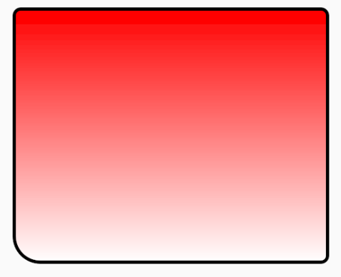
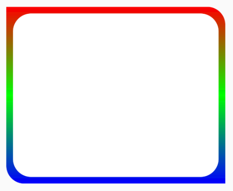
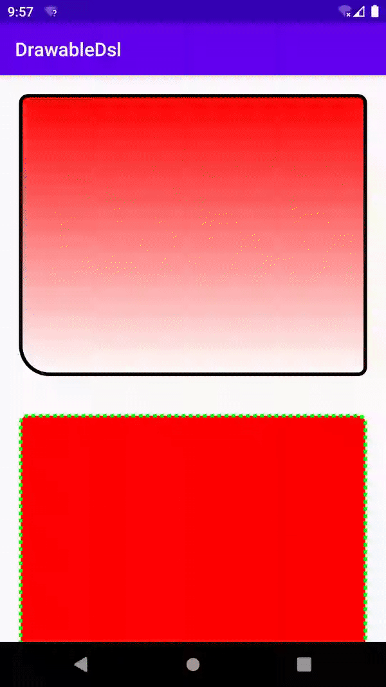

# Android Drawable Dsl

## Example

### shape
```kotlin
private fun createShapeDrawable() = shape(shape = GradientDrawable.RECTANGLE) {

    corners(
        corner = 20F,
        cornerBottomLeft = 80F
    )

    gradient(
        startColor = Color.RED,
        endColor = Color.WHITE
    )

    stroke(
        color = Color.BLACK,
        width = 10
    )
}
```




### layer-list
```kotlin
private fun createLayerList() = layerList(
    item {
        shape = shape {
            corners(
                cornerTopRight = 80F,
                cornerBottomLeft = 80F
            )

            gradient(
                startColor = Color.RED,
                centerColor = Color.GREEN,
                endColor = Color.BLUE
            )
        }
    },
    item(
        left = 30,
        top = 30,
        right = 30,
        bottom = 30
    ) {
        shape = shape {
            color = Color.WHITE
            corners(80F)
        }
    }
)

```




### more 


